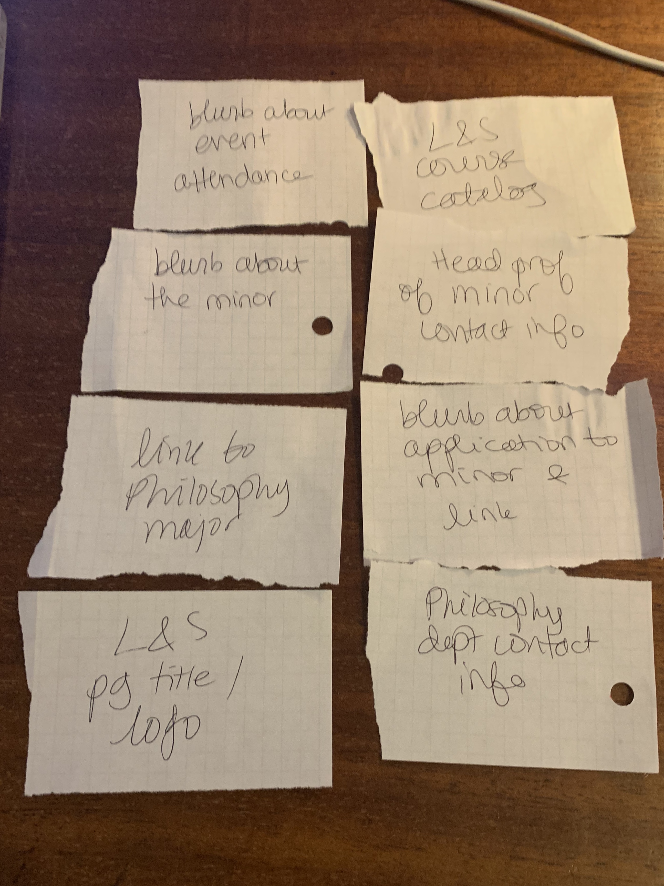
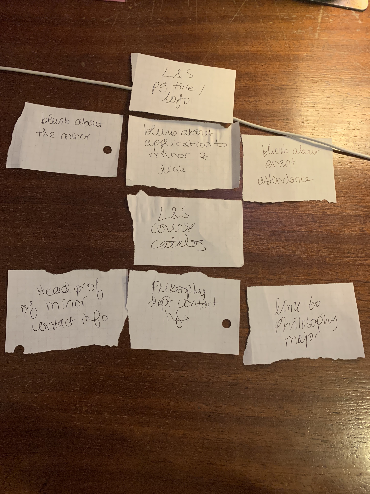
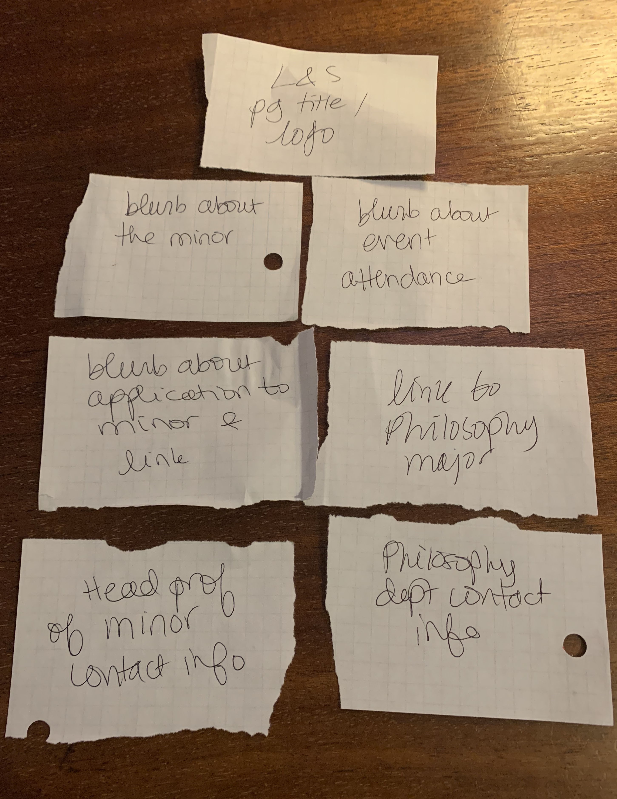
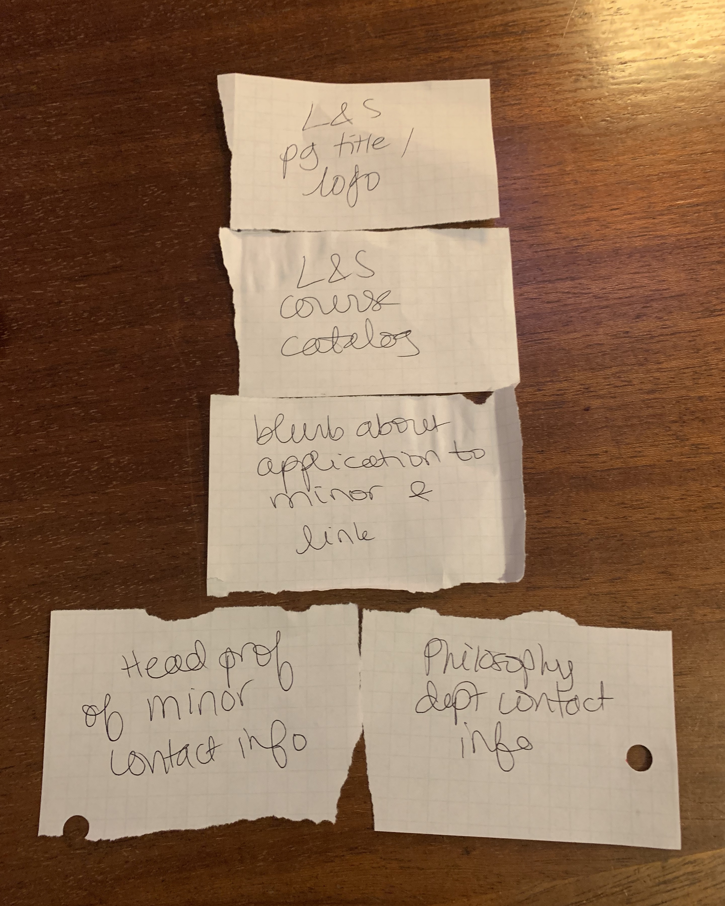
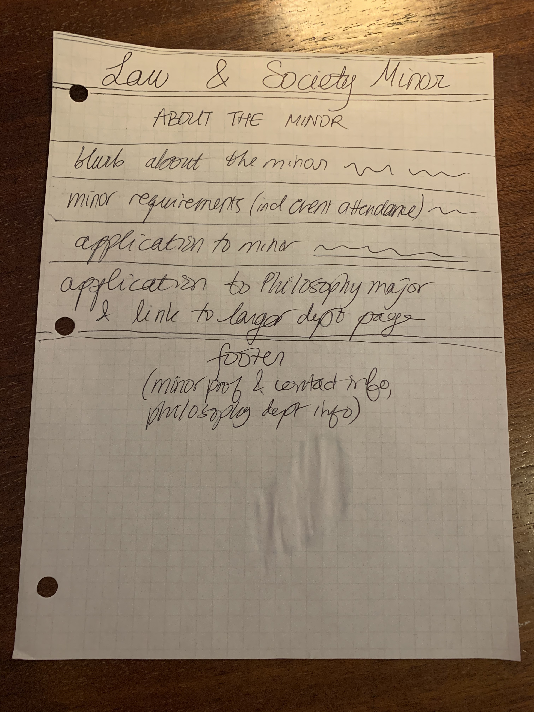
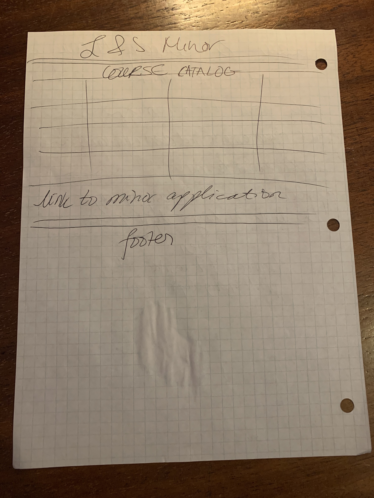
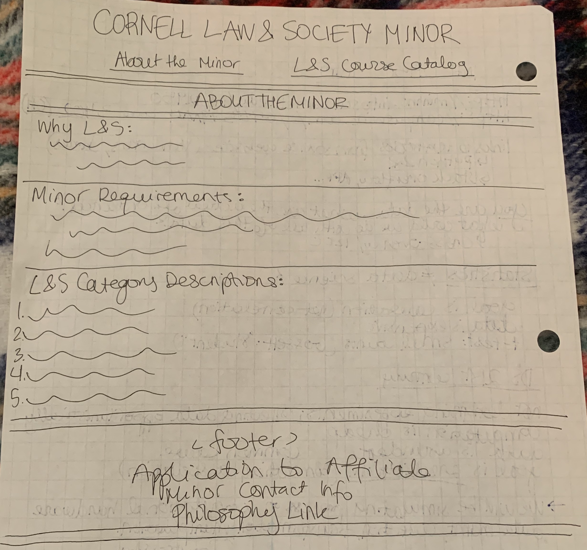
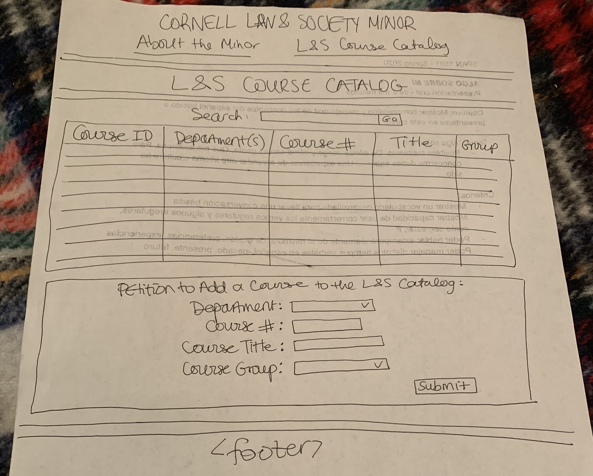
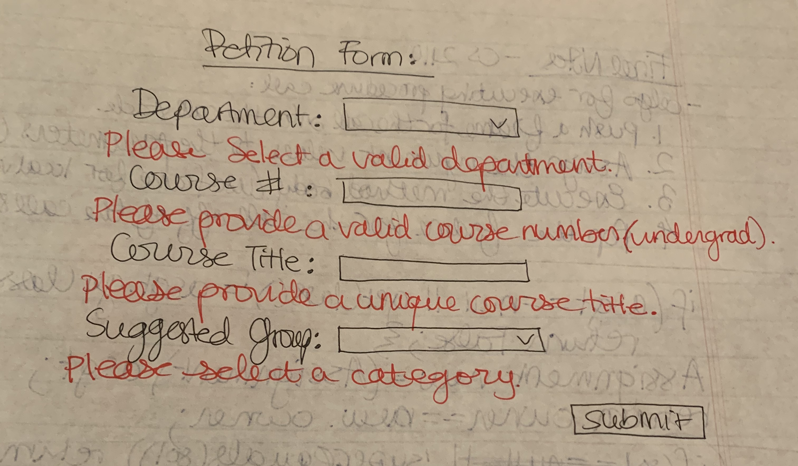

# Project 2: Design Journey

Be clear and concise in your writing. Bullets points are encouraged.

**Everything, including images, must be visible in VS Code's Markdown Preview.** If it's not visible in Markdown Preview, then we won't grade it.

## Catalog (Milestone 1)

### Describe your Catalog (Milestone 1)
> What will your collection be about? What types of attributes will you keep track of for the *things* in your catalog? 1-2 sentences.

My catalog will be about the courses students can take for the Law and Society Minor. I will keep track of the course id, number, title, department, and the group requirement they satisfy within the minor, and note whether the course listed is approved, petitioned, or denied.

### Target Audience(s) (Milestone 1)
> Tell us about your target audience(s).
My target audiences will be students at Cornell considering the minor, prospective students who have been admitted and are deciding whether or not to come to Cornell and who might be interested in the minor, and students who are already affiliated with the minor (and may be trying to petition a course). All of these categories of student will need to know which courses to choose in order to satisfy all of the requirements they need for their Cornell career plan.

### Design Patterns (Milestone 1)
> Review some existing catalogs that are similar to yours. List the catalogs you reviewed here. Write a small reflection on how you might use the design patterns you identified in your review in your own catalog.

1. https://philosophy.cornell.edu/law-society-courses
This page lists all of the eligible courses (an overwhelming list), and bolds the ones that are being offered in the current semester. It might be more useful to simply include the ones that are being offered that semester in a separate category to make it easier to find them in the large number that are listed, though it is nice to be able to appreciate the vastness of the minor. The listings include the course titles, numbers, and cross-listings, all of which might be useful information to include.

2. https://classes.cornell.edu/browse/roster/SP20
Class Roster is a more sophisticated catalog than the last, containing a search function with many filtering options for the search and a layout that presents all course options in their respective subjects and academic groups. I'd like to mimic some of this by having some search filter functions in addition to just a list of information, as this page does.

3. http://courses.cornell.edu/
Courses of Study has a lot more information than either of the previous two sites, including descriptions of major requirements and links between related departments, but is much harder to navigate efficiently. The information about requirements might be nice to incorporate in some way if it makes sense for the website, so that students understand how to guide their choices of classes among those on the list, but I intend for the site I design to be simpler to navigate and understand.

4. https://infosci.cornell.edu/undergraduate/info-sci-majors/ba-information-science-college-arts-sciences/degree-requirements
This site presents specific information for IS majors in A&S, and does so in more of a paragraph format. It also has a sidebar that clearly lists the different required components of the major and their separate details. Along with courses listed under IS, it specifies which other classes in different departments are necessary for the major or minor. This mixed-media approach might be a good way to mix in requirement information with course information.


## Design & Planning (Milestone 2)

## Design Process (Milestone 2)
> Document your design process. Show us the evolution of your design from your first idea (sketch) to design you wish to implement (sketch). Show us the process you used to organize content and plan the navigation, if applicable.
> Label all images. All labels must be visible in VS Code's Markdown Preview.
> Clearly label the final design.

First, I wrote down all of the pieces I wanted to include in the website, in no particular order:


Next, I sorted them all into a hierarchy that could theoretically be housed on one webpage:


Next, I separated them into two pages, since it felt like the one-page version would be too crowded:



Next, I drew the page design for each one and gave them sensible titles:

About the Minor:


L&S Course Catalog:


After going over the project requirements and working on some of the coding for the website, I've realized that I forgot to include a nav bar when I split the design into two pages, and I need to include the petition form to add to the catalog. I also want to include the application to affiliate as well as the links to the philosophy major and department page smaller components of the site embedded in different places, since these pieces link out of the site I am building.

I came up with these final designs for the pages:

FINAL About the Minor:


FINAL L&S Course Catalog:


Petition Form with Feedback:


## Partials (Milestone 2)
> If you have any partials, plan them here.

1. init
    - sql query against database, typical init functionality
2. head
    - UTF-8
    - page title
    - link to CSS stylesheet
3. header
    - Law and Society title
    - page title
    - nav (includes link to app to the minor)
5. footer
    - head Professor of minor and their contact information
    - minor email
    - philosophy department info (link, building)


## Database Schema (Milestone 2)
> Describe the structure of your database. You may use words or a picture. A bulleted list is probably the simplest way to do this. Make sure you include constraints for each field.

Table: law_society_catalog
- id (id): INT {PK, NN, U}
- department(s) (dept): TEXT {NN}
- course number (num): INT {NN}
- course title (course): TEXT {NN, U}
- minor group (grouped): INT
- status (approved): TEXT {NN}

## Database Query Plan (Milestone 2)
> Plan your database queries. You may use natural language, pseudocode, or SQL.]

1. All records

    ```sql
        SELECT * FROM law_society_catalog WHERE (id LIKE '%' || :search || '%' OR dept LIKE '%' || :search || '%' OR num LIKE '%' || :search || '%' OR course LIKE '%' || :search || '%' OR grouped LIKE '%' || :search || '%' OR approved LIKE '%' || :search || '%')
    ```

2. Search records

    ```sql
        SELECT * FROM law_society_catalog WHERE (" .$search_field. " LIKE '%' || :search || '%')
    ```

3. Insert record

    ```sql
        INSERT INTO law_society_catalog (id, dept, course, grouped, approved) VALUES (:id, :dept, :num, :course, :grouped, :approved)
    ```


## Code Planning (Milestone 2)
> Plan any PHP code you'll need here.

- includes
- page title
- db connection
- create array to tell user if petition to add course was successful:
```php
    $messages = array();
```
- function to print record:
```php
function print_record($record)
```
- form for search:
```php
    const SEARCH_FIELDS = [];
```
- security for search fields
- petition to add form
- message to user about add success/failure:
```php
    <?php
        foreach ($messages as $message) {
        echo "<p><em>" . htmlspecialchars($message) . "</em></p>\n";
        }
    ?>
```
- get result:
```php
    $sql = "SELECT * FROM law_society_catalog;";
    $result = exec_sql_query($db, $sql);
```
- loop to print records into table:
```php
    $records = $result->fetchAll();
        foreach($records as $record) {
            print_record($record);
        }
```

# Reflection (Final Submission)
> Take this time to reflect on what you learned during this assignment. How have you improved since Project 1? What things did you have trouble with?

I definitely learned a lot of debugging on this one. First, for some reason, my database wasn't showing up on the page! I couldn't figure out why not, even though I could see there was some kind of syntax errors thanks to the output message. Turns out I had a line of code written in two places that I only needed once. Then, I didn't know why suddenly all of my submissions weren't working. Turns out the entries were being nullified since the id of the form item didn't match the variable in the filter_input function, something I hadn't realized was necessary. These details took me a great deal of time to figure out, but in consequence I've improved my knowledge of SQL and the course material, as well as my habits for the course–this time I remembered to push!
